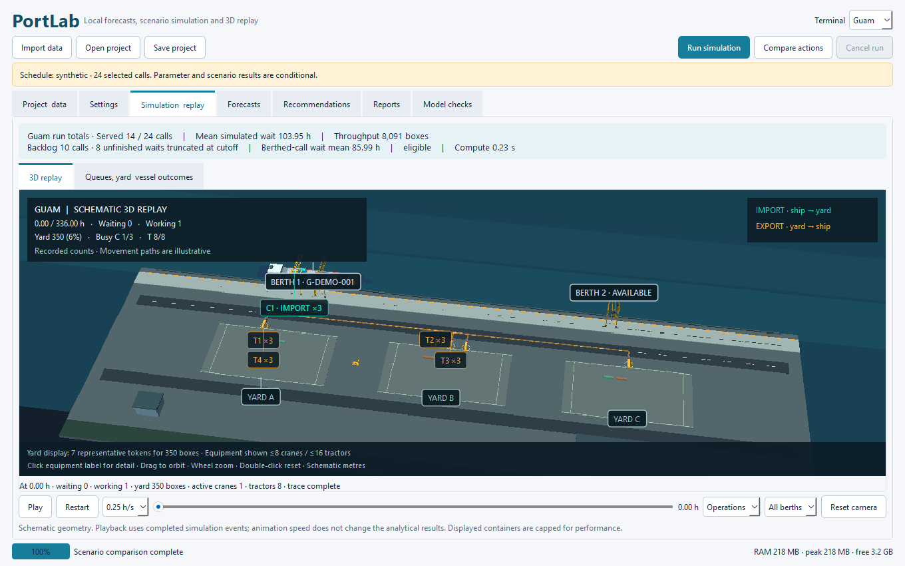
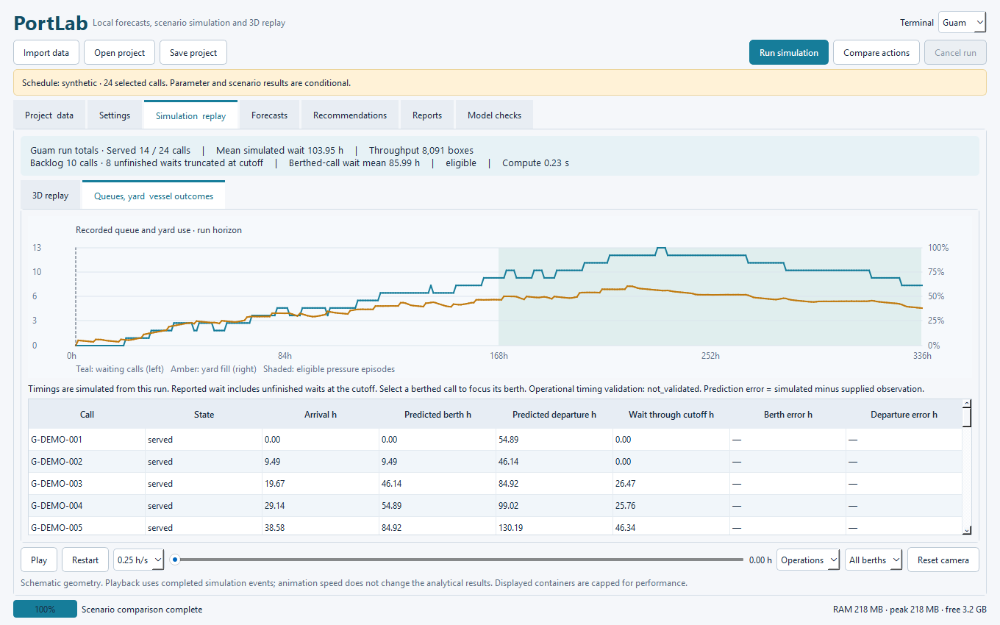
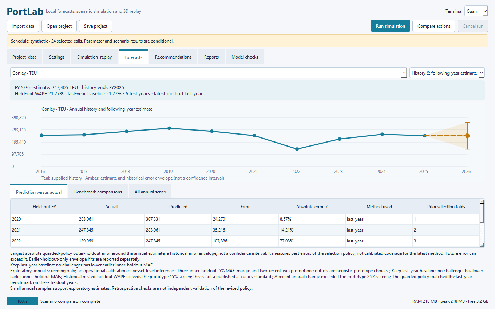

# PortLab Desktop

An offline Python desktop laboratory for Guam and Conley port planning: exploratory annual forecasts, finite-resource vessel simulation, conditional operating comparisons, and animated 3D replay.

PortLab connects editable data and settings to inspectable results. It distinguishes reported annual observations, synthetic vessel schedules and assumed operating parameters. Operational predictions have not been independently calibrated or validated against real vessel timing logs.

**Current version: 0.2.0 · Windows x64 · No subscription or cloud account required**

[Download the Windows application](https://github.com/Rezwanm381/portlab-desktop/releases/latest) · [Getting started](docs/GETTING_STARTED.md) · [Data and model](docs/DATA_AND_MODEL.md) · [Validation](docs/VALIDATION.md)



## Overview

1. Import vessel calls or annual histories from CSV/XLSX. A matching JSON settings sidecar loads automatically.
2. Configure berths, cranes, tractors, service variability, yard inventory, dwell and recommendation thresholds.
3. Run a scenario in a background worker, inspect queues and vessel outcomes, and replay recorded activity.
4. Compare operating alternatives after the observation and persistent-pressure rule is met.
5. Inspect annual prediction errors and export HTML, XLSX, CSV and complete JSON reports.

Saved projects preserve inputs and settings. Cancellation retains consistent partial results. Settings changes visibly mark earlier results stale.

## Models and visual layer

| Layer | Implementation | Interpretation |
| --- | --- | --- |
| Annual prediction | Earlier-only rolling holdouts; guarded last-year, trailing-mean and custom damped-trend selection | Exploratory estimates; boxes and TEU remain separate |
| Terminal simulation | SimPy discrete-event model; shared resources, compatibility, finite yard/apron, dwell and staging | Conditional scenarios using supplied parameters |
| Recommendations | Paired replications, family-adjusted improvement bounds, accounting and cargo safeguards | Full-horizon counterfactuals; no purchase decision or ROI |
| Interface | Native PySide6/Qt desktop application | Local imports, presets, projects, progress and diagnostics |
| Replay | Panda3D OpenGL framebuffer in Qt; supplied COLLADA/BAM models | Recorded activity with schematic geometry and bounded samples |

Crane dispatch prefers feasible imports, reserving yard and apron space together. Ready exports can load when imports lack space. Later appointments may stage exports before the horizon ends, with separate accounting. This is a schematic policy; hatch/stow plans, crane travel time and vessel stability are absent.

The default recommendation gate requires **168 hours of observation** and **24 hours of uninterrupted queue pressure**. False pressure resets persistence. These are editable project assumptions.

Replay includes Operations, Overview, Top and Orbit views, berth focus, equipment details, cargo routes and occupancy-scaled yard samples. Cancelled runs end at their actual cutoff; incomplete traces disclose unavailable yard totals outside retained coverage.



## Prediction results

The supplied history contains **26 reported annual observations**: six Guam box totals and ten Conley totals for each of boxes and TEU. No synthetic annual rows or inferred Guam TEU were added.

| Series | Held-out fiscal years | Targets | WAPE | Mean absolute error |
| --- | --- | ---: | ---: | ---: |
| Guam boxes | 2024–2025 | 2 | 1.216% | 1,026.5 boxes |
| Conley boxes | 2020–2025 | 6 | 21.501% | 28,210.2 boxes |
| Conley TEU | 2020–2025 | 6 | 21.267% | 49,541.3 TEU |

WAPE is total absolute error divided by total actual volume in the held-out years, not a probability of correctness. The revised policy matches the last-year benchmark on these observations. Its development used this history, so the replay remains retrospective evidence; Guam has only two test targets and Conley's errors remain substantial.

The estimate year follows the last supplied actual fiscal year. With actuals through FY2025, the displayed estimate is FY2026, whose fiscal periods have ended without supplied actual totals. Historical error envelopes are not calibrated confidence intervals.

Optional observed berth-start and departure times produce paired MAE, RMSE, bias and coverage diagnostics. They compare a configured run with supplied observations; they do not automatically fit parameters or establish independent validation. The included operational schedules are synthetic and correctly report **not validated**.



## Run the desktop application

Download `PortLab_Desktop_v0.2.0_Windows.zip` from [Releases](https://github.com/Rezwanm381/portlab-desktop/releases), extract the complete folder to a writable location and open `PortLab.exe`. Keep `_internal` beside the executable. No separate Python installation is needed.

For an import check, select **either** `examples/synthetic_import_test/guam_synthetic_test.csv` **or** its XLSX equivalent. Keep the matching settings JSON alongside it. The 32 fictional calls intentionally create congestion; the checked scenario serves 11 calls and retains 21 in backlog at its 336-hour cutoff.

[Getting started](docs/GETTING_STARTED.md) covers settings, replay, projects and reports. [Input contracts](templates/README.md) define fields, units, provenance and timestamps.

## Run from Python source

The tested environment is Python 3.12 on Windows. From the repository root:

```powershell
python -m venv .venv
.\.venv\Scripts\python.exe -m pip install -r requirements.txt
.\.venv\Scripts\python.exe -m portlab
```

Use `requirements.lock.txt` for the exact Windows build environment, including PyInstaller.

```powershell
.\.venv\Scripts\python.exe -m unittest discover -s tests -v
.\.venv\Scripts\python.exe tools\desktop_check.py --output verification\desktop
.\.venv\Scripts\python.exe tools\phase2_check.py
.\.venv\Scripts\python.exe tools\visual_smoke.py
.\.venv\Scripts\python.exe tools\build_release.py --smoke
.\.venv\Scripts\python.exe tools\package_delivery.py
```

GPU/desktop checks need a local graphical Windows session. The automated unit workflow runs calculation/data/replay-state tests. The manual Windows build workflow produces artifacts without publishing a release automatically.

## Validation and resource use

The v0.2.0 verification passed **69 automated tests**, **132 desktop workflow checks**, and **248 assertions in the latest evidence-interface check**, including the curated CSV/XLSX dataset. Assertions repeated during worker waits can change the count. The frozen executable passed simulation, comparison, rendering and report export; all 11 required physical/accounting checks passed. All nine frozen code modules and 70 bundled resource files match current source. Publication checks were completed on 5 October 2026.

On Ryzen 7 8845HS, 16 GB RAM and an RTX 4050 Laptop GPU, measured usage was approximately **218–248 MiB process RAM** for the packaged demo and desktop workflow. Small simulations took **0.14–0.24 seconds**, six-replication comparisons **6–9 seconds**, and final mean rendering time was about **10 ms**. This is measured rendering time rather than guaranteed end-to-end frame rate.

Visuals are capped at 30 frames/s and 120 cargo tokens, with representative vessels/equipment. Computation uses the CPU; no GPU training or paid API is required. Measurements apply to tested scenarios and vary with input size and other applications.

## Repository structure

```text
portlab-desktop/
├── portlab/                   # data, forecasts, simulation, Qt UI and replay
├── assets/                    # supplied models, compiled BAMs and provenance
├── data/                      # reported history and illustrative presets
├── examples/                  # tested synthetic import dataset
├── templates/                 # input schemas and field contracts
├── tests/                     # analytical, data and replay regressions
├── tools/                     # asset conversion, checks and packaging
├── docs/                      # guide, architecture, audit and screenshots
├── licenses/                  # dependency notices and license texts
└── .github/workflows/         # unit checks and manual Windows build
```

Local environments, private archives, chats, working outputs and generated distributions are excluded from Git history. Executables are distributed as release assets.

## Limitations and next improvements

The largest remaining need is actual arrival, berth-start, departure, workload, equipment-availability and dwell records. Calibrate on one period and evaluate a separate later period. Additional annual/monthly actuals and explanatory demand variables would improve forecasting evidence.

Berths are homogeneous, travel/gate behavior is aggregated, within-batch timing is approximate, and geography is schematic. Costs, acquisition delays and empirically calibrated endogenous feedback are absent. Numerical conservation does not establish real capacity, causal benefit or investment returns.

See [the model review](MODEL_REVIEW.md), [data and provenance](docs/DATA_AND_MODEL.md), and [architecture](docs/ARCHITECTURE.md).

## Skills demonstrated

Python desktop development · discrete-event simulation · finite-resource scheduling · time-series benchmarking · rolling-origin evaluation · 3D event replay · data validation · scenario analysis · portable Windows packaging.

## Rights, citation and contributions

This is a public portfolio and software review project. No public reuse license has been assigned; [LICENSE_STATUS.md](LICENSE_STATUS.md) records the status of code, examples, supplied assets and source data. Third-party runtimes retain their own licenses under [licenses/](licenses/THIRD_PARTY_NOTICES.md).

[CITATION.cff](CITATION.cff) identifies this software release and repository owner. See [CONTRIBUTING.md](CONTRIBUTING.md) for reproducible changes and [CHANGELOG.md](CHANGELOG.md) for release history.
