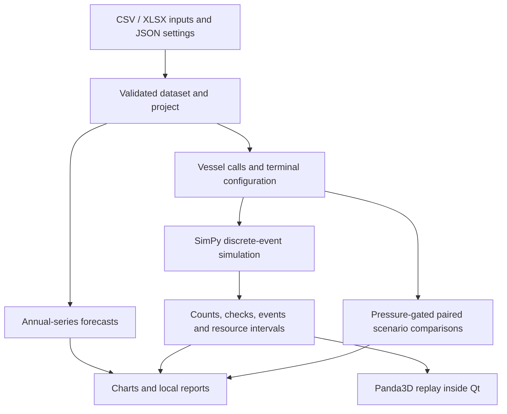

# Architecture

PortLab is a local Python desktop application. PySide6 owns the interface,
SimPy runs the operating scenarios, and Panda3D renders the schematic replay.
Forecasting and simulation are separate branches of the validated dataset:
annual totals do not become vessel schedules automatically.

## Calculation and data flow

`data.py` validates counts, units, time origins, duplicate calls and evidence
labels before importing a dataset. Projects preserve those inputs and settings.
Boxes and TEU remain separate annual series.

Annual forecasts compare last-year, three-year mean and damped-trend methods.
Rolling historical holdouts keep each target out of both fitting and method
selection. Reported MAE, RMSE and WAPE describe those retrospective errors;
the shaded forecast envelope is a historical error envelope.

`engine.py` models shared berths, cranes and tractors, finite yard and apron
space, export staging and import dwell. Cargo accounting, resource intervals
and incomplete calls are returned together in `SimulationResult`. Cancellation
settles the current event timestamp and records the actual simulated cutoff.

Action comparisons require the configured observation and uninterrupted queue
pressure rule. They rerun full-horizon scenarios with paired seeds and changed
settings, then check wait improvement, call/cargo outcomes and physical
accounting. These conditional comparisons assume changed settings from hour
zero; they do not model purchasing, delivery delays or investment returns.

## Replay and interface

`visual.py` indexes recorded intervals and yard events. Seeking changes only
the replay clock. The renderer interpolates schematic equipment paths between
recorded times; playback speed does not alter calculated outcomes. Missing or
capped yard event coverage is shown explicitly. Counts include all simulated
resources while visual pools stay bounded: 120 cargo tokens, 24 vessels,
8 cranes and 16 tractors, with a render target at most 1280 × 720 pixels.

`ui.py` coordinates background Qt workers, settings, projects, charts and replay
controls. The CPU performs calculations; the local graphics driver draws the
scene. Reports are written locally as HTML, Excel, CSV and complete JSON with
inputs, forecasts, scenario outcomes and checks.

## Code map

| Module | Responsibility |
| --- | --- |
| `portlab/contracts.py` | Shared input and result dataclasses |
| `portlab/data.py` | Imports, project validation, forecasts and report export |
| `portlab/engine.py` | Operating simulation, pressure rule and scenario comparisons |
| `portlab/visual.py` | Replay indexing, bounded 3D scene and camera controls |
| `portlab/charts.py` | Native charts for forecasts and operating traces |
| `portlab/ui.py` | Desktop workflow and worker coordination |
| `tools/prepare_assets.py` | Safe DAE-to-BAM geometry conversion |

The supplied schedule is synthetic, equipment settings are scenario assumptions,
and geometry is illustrative. Operational timing predictions require measured
call data and calibration. See [MODEL_REVIEW.md](../MODEL_REVIEW.md),
[VALIDATION.md](../VALIDATION.md), and [asset provenance](../assets/README.md).
